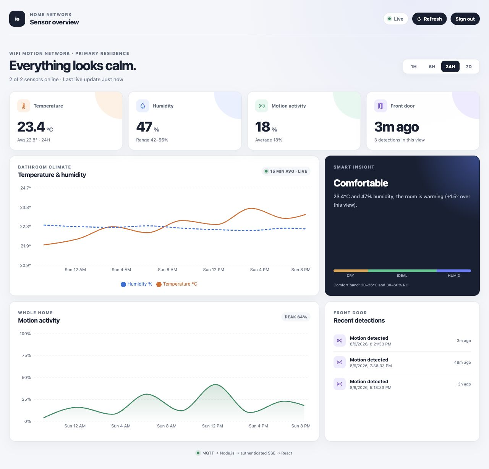
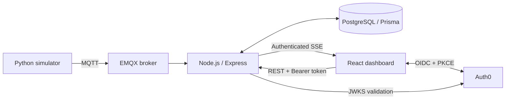
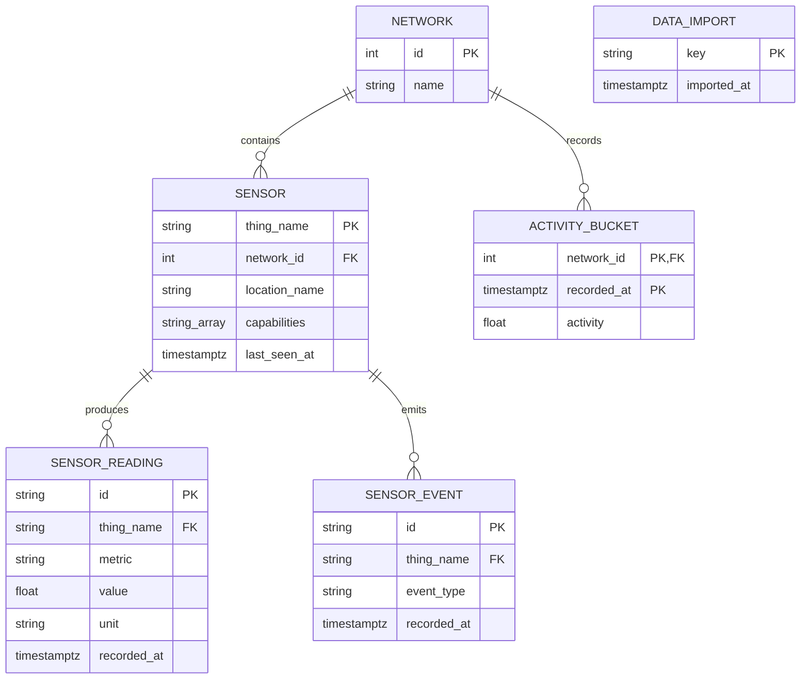

# IoT Sensor Dashboard

[](https://github.com/xjasonlyu/iot-sensor-dashboard/actions/workflows/e2e.yml)
[](frontend)
[](api_spec.yaml)
[](https://petstore.swagger.io/?url=https%3A%2F%2Fraw.githubusercontent.com%2Fxjasonlyu%2Fiot-sensor-dashboard%2Fmain%2Fapi_spec.yaml)
[](docker-compose.yaml)
[](LICENSE)

## Introduction

IoT Sensor Dashboard is a full-stack home monitoring application for exploring
historical sensor data and watching new readings arrive in real time. It combines a
responsive React interface with an Express API, PostgreSQL persistence, MQTT device
messaging, authenticated Server-Sent Events (SSE), and Auth0 login—all packaged as a
five-container Docker Compose stack.

### Quickstart

With Docker installed, start the complete stack from a fresh clone:

```bash
git clone https://github.com/xjasonlyu/iot-sensor-dashboard.git
cd iot-sensor-dashboard
docker compose up -d
```

Open <http://localhost:3000>. The backend API is available at
<http://localhost:9000>, with a health endpoint at
<http://localhost:9000/health>.

Use either <http://localhost:3000> or <http://127.0.0.1:3000>; the demo Auth0
tenant only allows these origins.

Sign in to the demo Auth0 tenant with the following demo-only credentials:

```text
Email:    demo@example.com
Password: demo
```

The first startup applies the committed Prisma migrations and imports the bundled
sensor and activity data. Later restarts reuse the PostgreSQL volume and skip the
completed import.

```bash
# Stop the stack and keep local data
docker compose down

# Stop the stack and reset local data
docker compose down -v
```

> [!NOTE]
> The tracked `.env` contains demo PostgreSQL values and public Auth0 identifiers so
> the project works without additional setup. Replace them before using the project
> in another environment. No Auth0 client secret is used or stored.

## Demo Screenshots



_The screenshot shows the 1-year view: imported 2025 history remains visible while
the Docker simulator continues appending live 2026 readings._

## Contents

- [License](#license)
- [How it works](#how-it-works)
- [Features](#features)
- [Architecture](#architecture)
- [Data model](#data-model)
- [Technical decisions](#technical-decisions)
- [Authentication](#authentication)
- [API contract](#api-contract)
- [Development](#development)
- [Testing](#testing)
- [Production considerations](#production-considerations)
- [AI usage](#ai-usage)

## License

IoT Sensor Dashboard is free and open-source, licensed under the [MIT License](LICENSE).

## How it works

1. Docker Compose starts the React frontend, Express backend, PostgreSQL database,
   EMQX broker, and Python sensor simulator.
2. The backend applies database migrations and idempotently imports the sample data
   from `data/sensors.json` and `data/activity.json`.
3. The simulator publishes temperature, humidity, motion, and door events to EMQX
   over MQTT.
4. Express consumes those messages, persists them through Prisma, and broadcasts
   them to authenticated browsers over SSE.
5. The dashboard loads bounded historical data through REST, then merges live SSE
   events into its cards, charts, sensor status, and recent activity timeline.
6. Auth0 handles user login with Authorization Code + PKCE; the backend validates
   each API token against the configured issuer, audience, and JWKS.

## Features

- Live temperature, humidity, motion, door activity, and sensor status
- Historical charts with 1H, 6H, 24H, 7D, 30D, and 1Y presets
- MQTT-powered card and chart updates over authenticated SSE
- Automatic reconnect with exponential backoff and `Last-Event-ID` replay
- Auth0 login, token refresh, and sign-out using OIDC Authorization Code + PKCE
- Backend JWT validation for signature, issuer, expiry, and API audience
- Recent door detection timeline with clear loading, empty, and error states
- Lightweight comfort and temperature-trend insight
- Responsive layouts for desktop, tablet, and mobile
- Generated TypeScript API models and client from the OpenAPI specification
- Playwright coverage for initial loading, range changes, recovery, and live updates

## Architecture



| Service     | Responsibility                                  | Host access      |
| ----------- | ----------------------------------------------- | ---------------- |
| `frontend`  | React/TypeScript build served by Vite Preview   | `localhost:3000` |
| `backend`   | Express REST and SSE API                        | `localhost:9000` |
| `postgres`  | Persistent PostgreSQL 17 database               | Internal only    |
| `emqx`      | MQTT broker                                     | Internal only    |
| `simulator` | Python publisher for sensor and activity events | Internal only    |

PostgreSQL, MQTT, and the EMQX dashboard are intentionally not published to the
host. They remain implementation details of the local Compose network.

## Data model

The schema keeps device metadata separate from high-volume time-series readings
and events. Networks own sensors and aggregate activity, while each sensor owns its
individual readings and door events.



| Table | Purpose | Key design |
| ----- | ------- | ---------- |
| `networks` | Top-level ownership boundary for a monitored home or site | Integer primary key |
| `sensors` | Device identity, location, capabilities, and latest contact time | Indexed by `network_id` |
| `sensor_readings` | Temperature, humidity, and other numeric time-series readings | Indexed by `(thing_name, recorded_at)` for bounded history queries |
| `sensor_events` | Discrete sensor events such as front-door motion detections | Indexed by `(thing_name, recorded_at)` for recent-event queries |
| `activity_buckets` | Network-level motion percentages for each time bucket | Composite primary key `(network_id, recorded_at)` prevents duplicate buckets |
| `data_imports` | Records completed seed imports so startup remains idempotent | Import key is the primary key; this table has no domain relationships |

The committed Prisma schema at
[`backend/prisma/schema.prisma`](backend/prisma/schema.prisma) is the source of
truth for columns, relations, mappings, and indexes. The diagram intentionally
shows the operational `data_imports` table without a relationship because it tracks
startup work rather than domain data.

## Technical decisions

**SSE for browser updates.** The application has a one-way server-to-browser data
flow, so SSE keeps the protocol and client smaller than WebSockets. A fetch-based
client can attach the Bearer token, reconnect with backoff, and resume with
`Last-Event-ID`. WebSockets would be preferable for low-latency device control or
other bidirectional features.

**REST for initial and historical state.** The dashboard first requests bounded,
time-bucketed history, then appends live SSE points. Refreshes and reconnects remain
predictable without sending the entire history over a stream.

**PostgreSQL with Prisma.** Historical imports and live events share one durable,
relational model. Committed migrations make startup deterministic, while Prisma
provides a typed data layer for the TypeScript backend.

**Plain React state.** The application has one primary screen and a small number of
data flows, so `useState` keeps server snapshots and UI state close
to the components that render them. `useMemo` derives presentation data, while
`useRef` holds mutable stream bookkeeping such as the active range and processed
event IDs without triggering extra renders. Redux or Zustand would add indirection
without solving a current cross-screen state problem; either would become more
valuable if the product grew into multiple routes with shared filters and caches.

**Recharts for visualization.** Recharts provides responsive, accessible SVG line
and area charts that compose naturally with React. It covers this dashboard's
tooltips, axes, legends, and responsive sizing with less custom code than D3. D3
would be the better choice for highly bespoke interactions or canvas-scale
rendering; Chart.js would also be a reasonable option, but its imperative canvas
lifecycle is less aligned with the component structure used here.

**Preset history ranges with adaptive aggregation.** Common monitoring windows stay
one click away, while the API reduces long views to larger time buckets: the 1-year
view uses daily points instead of returning raw per-second readings. This keeps the
payload and chart bounded while making the bundled 2025 sample data useful in 2026.

## Authentication

Auth0 provides hosted login, account management, password reset, and optional social
connections. The SPA holds its short-lived API token in memory and never receives a
client secret. Express validates RS256 access tokens locally and refreshes Auth0's
JWKS only when needed.

To use your own Auth0 tenant:

1. Create a **Single Page Application** and add `http://localhost:3000` to its
   **Allowed Callback URLs**, **Allowed Logout URLs**, and **Allowed Web Origins**.
2. Create an Auth0 Custom API with the identifier you want to use as the OAuth
   audience and select **RS256**.
3. Update the public identifiers in the root `.env`:

```dotenv
VITE_AUTH0_DOMAIN=your-tenant.us.auth0.com
VITE_AUTH0_CLIENT_ID=your-spa-client-id
VITE_AUTH0_AUDIENCE=https://your-api-identifier
```

Every valid Auth0 account can currently view the dashboard; role- or network-based
authorization is intentionally left as a production follow-up.

## API contract

[`api_spec.yaml`](api_spec.yaml) is the source of truth for the REST and SSE
interface. OpenAPI Generator produces the shared TypeScript models and Fetch client
in `packages/api-contract`. Explore the contract with the
[interactive Swagger UI](https://petstore.swagger.io/?url=https%3A%2F%2Fraw.githubusercontent.com%2Fxjasonlyu%2Fiot-sensor-dashboard%2Fmain%2Fapi_spec.yaml).

```text
GET /health
GET /api/v1/me
GET /api/v1/dashboard/summary
GET /api/v1/sensors
GET /api/v1/sensors/:sensorId/readings
GET /api/v1/sensors/:sensorId/events
GET /api/v1/networks/:networkId/activity
GET /api/v1/realtime/events
```

Regenerate the client after changing the specification:

```bash
npm run api:generate
```

Generation uses the pinned `openapitools/openapi-generator-cli:v7.24.0` Docker
image, so it requires Docker but not a local Java installation. Generated source is
committed under `packages/api-contract/src/generated` and should not be edited by
hand.

## Development

Docker Compose is the canonical runtime. To install every JavaScript dependency set
for local checks and editor tooling:

```bash
npm ci
npm ci --prefix packages/api-contract
npm ci --prefix backend
npm ci --prefix frontend
```

Useful verification commands from the repository root:

```bash
npm run api:generate
npm run backend:typecheck
npm run frontend:typecheck
npm run backend:build
npm run frontend:build
docker compose config
```

After changing `backend/prisma/schema.prisma`, generate and apply a development
migration:

```bash
cd backend
npm run prisma:generate
npx prisma migrate dev --name describe_your_change
```

## Testing

The Playwright suite uses deterministic authentication and API fixtures while
running the real React production build. It covers the six visible presets and
verifies that the 1-year selection requests daily aggregation. Normal development
and production builds continue to use Auth0 and the backend.

```bash
npm ci
npm ci --prefix packages/api-contract
npm ci --prefix frontend
npx playwright install chromium
npm run e2e
```

Use `npm run e2e:ui` for the interactive runner. GitHub Actions runs the Chromium
suite on every push and pull request and uploads the HTML report.

## Production considerations

A production deployment should add per-user network authorization, rate limiting,
verified email or MFA where appropriate, MQTT credentials with ACLs and TLS, shared
SSE replay storage such as Redis, a production static web server such as Nginx or
Caddy, and broader integration and end-to-end coverage.

The next history UX improvement would keep the fast presets and add a **Custom**
from/to date selector. The backend would apply an aggregation interval based on the
selected duration, summary endpoints would accept the same explicit window, and the
UI would distinguish historical inspection from live mode with a clear **Return to
live** action. While inspecting a past window, SSE can remain connected for health
status without appending new points to the historical chart.

## AI usage

AI assistance was used to review the assignment, compare architectural options,
scaffold the OpenAPI/TypeScript boundaries, and refine documentation. The
implementation was kept intentionally small and validated
with TypeScript builds, API checks, Docker health checks, and browser inspection.
